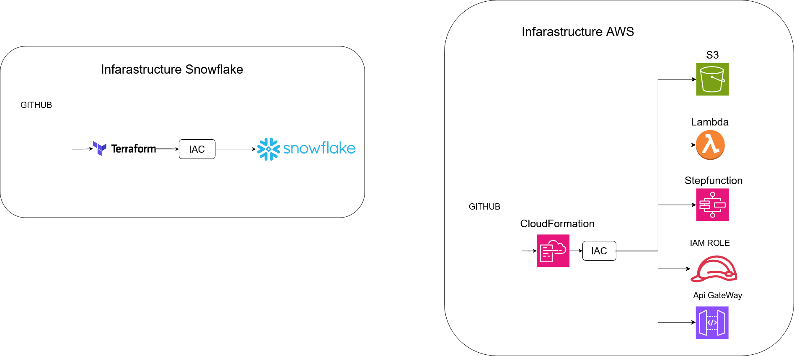
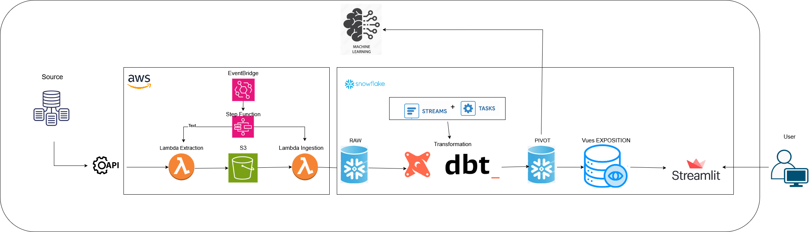

# Air Quality — Data Pipeline & Machine Learning

## Objectif du projet

Ce projet met en œuvre une **chaîne de traitement automatisée** pour la collecte, le stockage, la transformation et la modélisation de données de **qualité de l’air**.  
Il s’appuie sur une infrastructure **cloud-native** combinant :

- **AWS** pour l’extraction, l’ingestion et l’orchestration du flux  
- **Snowflake** pour la modélisation, transformation et le stockage structuré  
- **Streamlit & Jupyter** pour la visualisation et l’analyse exploratoire  
- **GitHub Actions + IaC (CloudFormation / Terraform)** pour le déploiement automatisé  

---

## 1. Architecture d’infrastructure

### Déploiement automatisé — AWS & Snowflake

L’infrastructure est entièrement gérée via **Infrastructure as Code (IaC)**.  
Deux outils sont utilisés :
- **AWS CloudFormation** : déploiement des ressources AWS (Lambda, StepFunction, S3, IAM)
- **Terraform** : déploiement des objets Snowflake (rôles, tables)



### **Infrastructure AWS**

- **GitHub Actions** → déclenchement du déploiement CloudFormation  
- **CloudFormation** → création des ressources AWS nécessaires  
- **Composants déployés :**
  - `S3` → stockage des fichiers extraits
  - `Lambda` → extraction, ingestion, normalisation des données
  - `StepFunction` → orchestration du flux ETL complet
  - `IAM Role` → gestion des permissions Lambda / StepFunction
  - `Api Gateway` → Api

### **Infrastructure Snowflake**

- **Terraform** gère la création des objets Snowflake (Data Warehouse, databases, rôles, users et prévileges.)

---

## 2. Flux de données (Pipeline ETL)



### Étapes du flux :

1. **Lambda Extraction**  
   - Appel API pour extraire les données sources (ex. capteurs de pollution)  
   - Stockage brut sur **Amazon S3**

2. **Lambda Ingestion**  
   - Lecture du fichier depuis S3  
   - Insertion dans la table **RAW** de Snowflake

3. **Lambda Normalisation**  
   - Nettoyage, standardisation, transformation avec dbt project snowflake des données vers la couche **PIVOT**

4. **Création des vues analytiques (VIEW GOLD)**  
   - Vues Snowflake (agrégées et nettoyées) utilisées par Streamlit et les notebooks Jupyter

5. **Visualisation & ML**
   - **Streamlit** pour la partie front (dashboard qualité de l’air)
   - **Jupyter / Machine Learning** pour l’analyse exploratoire 

---

## 7 Outils principaux

| Domaine | Technologie |
|----------|--------------|
| Orchestration | AWS Step Function |
| Compute | AWS Lambda, Warhouse |
| Stockage données brutes | Amazon S3 |
| Data Warehouse | Snowflake |
| IaC | CloudFormation / Terraform |
| CI/CD | GitHub Actions |
| Analyse & Modélisation | Python, Pandas, Scikit-learn |
| Visualisation | Streamlit, Jupyter |

---

```

