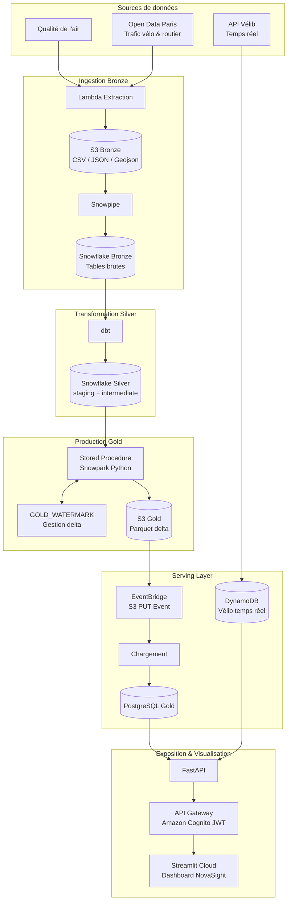

# Cahier des Charges
## Projet NovaSight  Plateforme Smart City Paris IDF
### Ingénierie des données & Visualisation temps réel

---

| Champ | Valeur |
|---|---|
| Référence | CDC-2026-001 |
| Version | 1.0 |
| Date | Juin 2026 |
| Auteurs | Amar HASNAOUI, Amine NAIT-SIDHOUM |
| Encadrante | Steve Elonga |
| Établissement | EFREI Paris  Master 2 Data Engineering & Intelligence Artificielle |

---

## 1. Présentation générale

### 1.1 Contexte

La ville de Paris génère quotidiennement des volumes importants de données environnementales et de mobilité issues de capteurs, d'APIs publiques et de sources gouvernementales. Ces données, dispersées et hétérogènes, ne sont pas exploitées de manière centralisée pour aider à la prise de décision ou à la sensibilisation citoyenne.

Dans le cadre du Master 2 Data Engineering & Intelligence Artificielle de l'EFREI Paris (certification RNCP36739  Expert en Ingénierie de Données), ce projet répond à une problématique concrète d'architecture de données en contexte cloud, en simulant les conditions d'un projet d'entreprise.

### 1.2 Problématique

> Comment concevoir une architecture de données cloud end-to-end permettant d'ingérer, transformer, centraliser et visualiser des données hétérogènes issues de sources publiques parisiennes, avec une qualité de données maîtrisée, un traitement automatisé et une exposition via une API sécurisée ?

### 1.3 Objectifs généraux

- Mettre en place un pipeline de données complet de type **Medallion Architecture** (Bronze -> Silver -> Gold)
- Automatiser l'ingestion et la transformation des données de manière **quotidienne et incrémentale**
- Exposer les données transformées via une **API REST sécurisée**
- Offrir un **dashboard interactif** à destination d'utilisateurs non techniques
- Appliquer les bonnes pratiques d'ingénierie des données en environnement cloud (CI/CD, versioning, IaC)

---

## 2. Périmètre fonctionnel

### 2.1 Inclus dans le périmètre

| Domaine | Description |
|---|---|
| Qualité de l'air | Mesures horaires de polluants (NO₂, PM10, PM2.5, O₃, SO₂) sur les stations IDF |
| Trafic vélo | Comptages journaliers sur les pistes cyclables parisiennes |
| Trafic routier | Débits et taux d'occupation des arcs de voirie parisiens |
| Vélib temps réel | Disponibilité des vélos et des bornes par station |
| KPI Smart City | Indicateurs agrégés croisant les 3 domaines par jour |
| Zones administratives | Indicateurs par arrondissement parisien |
| Alertes pollution | Dépassements de seuils OMS par station et par polluant |

---

## 3. Parties prenantes

| Acteur | Rôle |
|---|---|
| Amar HASNAOUI | Data Engineer/Architecture cloud |
| Amine NAIT-SIDHOUM | Data Scientist/Analyst  |
| Steve Elonga | Encadrant pédagogique EFREI |
| Utilisateurs finaux | Tout profil souhaitant consulter les données Smart City Paris via le dashboard |

---

## 4. Exigences fonctionnelles

### EF-01  Ingestion automatique des données (couche Bronze)

- Le système doit ingérer les données brutes depuis les sources publiques de manière automatique
- L'ingestion doit être déclenchée quotidiennement via une tâche planifiée
- Les données brutes doivent être stockées en l'état dans un lac de données
- Un mécanisme de doit charger automatiquement les fichiers vers les tables du Data Warehouse

### EF-02  Transformation et nettoyage (couche Silver)

- Le système doit transformer les données brutes 
- Les transformations incluent : déduplication, typage, renommage de colonnes, filtrage géographique (IDF uniquement), jointures spatiales
- Les modèles doivent être versionnés et testés (tests de nullité, de plage de dates, de cohérence)

### EF-03  Production des datamarts Gold (couche Gold)

- Le calcul des agrégats Gold doit être réalisé
- 7 datamarts doivent être produits :

| Datamart | Description |
|---|---|
| `dm_air_quality_daily` | Mesures journalières agrégées par station et polluant |
| `dm_alertes_pollution` | Dépassements de seuils OMS  |
| `dm_velo_daily` | Passages journaliers par compteur vélo |
| `dm_trafic_routier_daily` | Débit et occupation par arc de voirie |
| `dm_smartcity_kpi_daily` | KPI croisés air + mobilité par jour |
| `dm_zone_kpi_daily` | KPI par arrondissement parisien |
| `ref_arrondissements` | Référentiel géographique (GeoJSON) |

- Le système doit implémenter une gestion **delta** via une table de watermark (`GOLD_WATERMARK`) : seules les nouvelles dates sont exportées à chaque run
- Les datamarts sont exportés en **Parquet** 

### EF-04  Chargement vers la base de données gold

- Un traitement doit être déclenché automatiquement à chaque upload Parquet 
- Le traitement doit lire le fichier Parquet et effectuer un **UPSERT** dans gold
- Le chargement doit être **idempotent** : relancer la Lambda sur le même fichier ne doit pas créer de doublons

### EF-05  API REST

- Une API REST doit exposer les données Gold 
- L'API doit implémenter les endpoints suivants :

| Méthode | Endpoint | Description |
|---|---|---|
| GET | `/health` | Vérification de disponibilité |
| GET | `/kpi/summary` | KPI Smart City journaliers |
| GET | `/air-quality` | Mesures de qualité de l'air |
| GET | `/air-quality/alertes` | Dépassements de seuils (pagination offset/limit) |
| GET | `/mobilite/velo` | Trafic vélo journalier |
| GET | `/mobilite/trafic` | Trafic routier brut par arc |
| GET | `/mobilite/trafic/daily-avg` | Débit moyen agrégé par jour |
| GET | `/mobilite/velib` | Stations Vélib temps réel (DynamoDB) |
| GET | `/mobilite/velib/{id}` | Détail d'une station Vélib |
| GET | `/zones/kpi` | KPI par arrondissement |
| GET | `/zones/arrondissements` | Référentiel géographique |

- Chaque endpoint doit supporter des filtres par plage de dates et une pagination par `limit`/`offset`
- L'API doit être sécurisée par token 

### EF-06  Dashboard de visualisation

- Un dashboard interactif doit être accessible via navigateur web
- Il doit proposer 4 onglets : Vue d'ensemble, Qualité de l'air, Mobilité, Carte des zones
- La carte des zones doit afficher une **choroplèthe** par arrondissement parisien colorée selon l'indicateur sélectionné
- L'accès doit être protégé par une **authentification utilisateur** 

---

## 5. Exigences non-fonctionnelles

### ENF-01  Performance

| Indicateur | Cible |
|---|---|
| Temps de réponse API (P95) | < 3 secondes |
| Durée du pipeline complet | < 30 minutes |
| Chargement initial du dashboard | < 5 secondes (cache `st.cache_data` TTL 5 min) |

### ENF-02  Disponibilité

- L'API et le dashboard doivent être disponibles **24h/24, 7j/7**
- En cas d'échec d'un run, les données existantes dans gold restent accessibles 

### ENF-03  Sécurité

- L'API doit exiger un token JWT valide sur chaque requête
- Les secrets (identifiants RDS, clés AWS) doivent être stockés en variables d'environnement jamais dans le code source
- Les connexions doivent utiliser **SSL** (`sslmode=require`)

### ENF-04  Maintenabilité et traçabilité

- Les modèles dbt doivent être documentés via `schema.yml` (descriptions, tests de qualité)
- Le code source doit être versionné sur **GitHub**
- Le déploiement doit être automatisé via **GitHub Actions** (CI/CD)

### ENF-05  Scalabilité

- L'architecture doit permettre de monter en charge sans modification d'infrastructure
- L'ajout d'une nouvelle source de données doit se limiter à : un modèle nouveau dans chaque couche

---

## 6. Sources de données

| Source | Type | Fréquence | Format brut | Volume estimé |
|---|---|---|---|---|
| AIRPARIF / données air IDF | API publique | Horaire | CSV | ~50000 mesures/jour |
| Compteurs vélo Paris | API Open Data Paris | Horaire | JSON | ~2 000 lignes/jour |
| Trafic routier Paris | API Open Data Paris | Horaire | JSON | ~70 000 lignes/jour |
| Vélib Metropole | API JCDecaux temps réel | Continue | JSON | ~1 400 stations |
| Référentiel arrondissements | Statique | Ponctuel | GeoJSON | 20 arrondissements |

---

## 7. Architecture technique

### 7.1 Vue d'ensemble

### 7.2 Composants et technologies

| Composant | Technologie | Rôle |
|---|---|---|
| Stockage brut | Amazon S3 | Lac de données Bronze et Gold |
| Data Warehouse | Snowflake | Traitement Bronze -> Silver -> Gold |
| Transformation Silver | dbt  | Modèles SQL Bronze -> Silver |
| Calcul Gold | Snowpark Python (Spark dans snowflake)| Agrégats Gold + export Parquet delta |
| Chargement RDS | AWS Lambda | Lecture Parquet + UPSERT PostgreSQL |
| Base de service | Amazon RDS PostgreSQL | Serving layer pour l'API |
| Temps réel Vélib | Amazon DynamoDB | Stockage stations Vélib |
| API | FastAPI | Exposition REST des données |
| Passerelle API | Amazon API Gateway | Routage HTTPS + intégration Lambda |
| Authentification | Amazon Cognito | Gestion utilisateurs + tokens JWT |
| Dashboard | Streamlit Cloud | Visualisation utilisateur final |
| CI/CD | GitHub Actions | Déploiement automatique |
| Événements | Amazon EventBridge et task cron | schedule des traitement |

---

## 8. Contraintes

### 8.1 Contraintes budgétaires

- Le projet s'appuie exclusivement sur des **offres gratuites ou à coût marginal** (Snowflake trial, AWS Free Tier, Streamlit Community Cloud)
- Le suivi Finops sera fait par les vrais tarifs des provider pour avoir un cout réel de production

### 8.2 Contraintes sécurité

- Les données doient etre chifrées aux repos 
- Les Roles utilisateurs et applicatifs doivent respecter le principe du moindre privilege 
- Les identifiant de connexion stockées et cachés (jamais en dur)
- Accès aux données par une API sécurisée (authentification token)

---

## 9. Livrables

| # | Livrable | Description |
|---|---|---|
| L1 | Code source GitHub | Repository complet versionné (dbt, DDL Snowflake, Infra AWS, Infra Snowflake, Streamlit) |
| L2 | Pipeline de données opérationnel | Bronze -> Silver -> Gold -> RDS fonctionnel et schedulé quotidiennement |
| L3 | API REST déployée | API sur AWS |
| L4 | Dashboard | Application Streamlit déployée et accessible en ligne |
| L5 | Tests de qualité dbt | Assertions Silver (dates futures, cohérence min/max/avg, plages horaires) |
| L6 | CI/CD GitHub Actions | Workflows de déploiement automatique IAC, DDL, dbt, Streamlit |
| L7 | Cahier des charges | Ce document |

---

## 10. Planning prévisionnel

| Phase | Contenu | Durée estimée |
|---|---|---|
| Phase 1 Cadrage | Analyse des sources, choix d'architecture, provisionnement AWS/Snowflake | 3 jours |
| Phase 2 Ingestion Bronze | extraction, Ingestion, tables Bronze Snowflake | 1,5 jours |
| Phase 3 Transformation Silver | Modèles dbt (staging, intermediate, zones), tests qualité | 2 jours |
| Phase 4 Production Gold | Stored Procedure Snowpark, watermark delta, export Parquet | 1 jour |
| Phase 5 Serving Layer | RDS import, API FastAPI, Cognito | 2 jours |
| Phase 6 Dashboard | Streamlit, 4 onglets, choroplèthe | 2 jours |
| Phase CI/CD & recette | GitHub Actions, corrections | Tout au long du projet |

---

## 11. Priorisation des fonctionnalités & stratégie de livraison

### 11.1 Priorisation des fonctionnalités

| Fonctionnalité | Priorité | Phase | Justification |
|---|---|---|---|
| Ingestion Bronze | Haute | Phase 2 | Fondation du pipeline, bloque tout le reste |
| Transformation Silver | Haute | Phase 3 | Nécessaire pour alimenter le Gold |
| Pipeline Gold | Haute | Phase 4 | Cœur du traitement métier |
| Chargement bdd gold | Haute | Phase 5 | Prérequis pour l'API |
| API REST sécurisée (Cognito) | Haute | Phase 5 | Prérequis pour le dashboard |
| Dashboard  onglets Air & Mobilité | Haute | Phase 6 | Valeur métier principale |
| Dashboard  Carte des zones (choroplèthe) | Moyenne | Phase 6 | Valeur ajoutée, dépend du référentiel GeoJSON |
| Alertes pollution avec slider interactif | Moyenne | Phase 6 | Feature différenciante, dépend de dm_alertes_pollution |
| Vélib temps réel (DynamoDB) | Moyenne | Phase 5 | Source indépendante, peut être livrée en parallèle |
| CI/CD complet (GitHub Actions + Flyway) | Haute | Transverse | Bonne pratique, intégré dès le début |

### 11.2 Stratégie de livraison  MVP

**Approche retenue : MVP itératif**

Le projet adopte une approche MVP (Minimum Viable Product) en livraisons progressives plutôt qu'un Big Bang :

- **MVP (Phase 1 à 5)**  Pipeline complet opérationnel : Bronze -> Silver -> Gold -> API. Le dashboard est minimal mais fonctionnel avec les données qualité de l'air et mobilité.
- **Itération 1**  Enrichissement du dashboard : carte choroplèthe par arrondissement, slider alertes pollution, section Vélib temps réel.
- **Itération 2**  Industrialisation : CI/CD complet, documentation.

Cette approche permet de valider le pipeline de bout en bout avant d'investir dans les fonctionnalités de visualisation avancées.

---

## 12. Zones de risque & plans de mitigation

| # | Risque identifié | Probabilité | Impact | Plan de mitigation |
|---|---|---|---|---|
| R-01 | **Indisponibilité d'une API source** (qualité air, Open Data Paris) | Moyenne | Élevé | Implémenter une gestion d'erreur d'extraction |
| R-02 | **Perte de connexion Snowflake <-> AWS** | Faible | Élevé | Versionner la configuration d'intégration dans les DDL|
| R-03 | **Données sources mal structurées ou vides** (champs manquants, formats changeants) | Moyenne | Moyen | Tests de qualité dbt sur chaque modèle Silver, alertes en cas d'échec |
| R-04 | **Régression lors d'une mise à jour dbt** (modèle Silver cassé) | Moyenne | Élevé | pipeline bloque le déploiement si erreurs dans le dbt |
| R-05 | **Expiration du Snowflake Trial** avant fin de projet(dans le cadre du projet à efrei) | Moyenne | Élevé | prévoir migration vers un compte payant minimal |
| R-06 | **Accès concurrent au dashboard** | Faible | Faible | Cache `st.cache_data` (5 min) pour limiter les appels API, pagination côté serveur |

---

## 13. Critères de validation

| ID | Critère | Condition de réussite |
|---|---|---|
| CV-01 | Pipeline automatique | Exécution complète sans intervention manuelle chaque jour |
| CV-02 | Delta management | Une seconde exécution le même jour ne recharge pas les données déjà présentes |
| CV-03 | Idempotence gold | Rejouer sur le même fichier Parquet ne crée pas de doublons |
| CV-04 | Qualité des données | 100 % des tests dbt passent |
| CV-05 | Sécurité API | Toute requête sans token valide retourne HTTP 401 |
| CV-06 | Performance API | Temps de réponse correctes sur les endpoints principaux |
| CV-07 | Dashboard fonctionnel | Les 4 onglets affichent des données cohérentes avec les filtres appliqués |
| CV-09 | Carte des zones | La choroplèthe affiche les arrondissements colorés selon l'indicateur sélectionné |

---

