# Documentation Technique  NovaSight
## Plateforme Smart City Paris IDF · Architecture Médaillon Cloud

---

| Champ | Valeur |
|---|---|
| Version | 1.1 |
| Date | Juillet 2026 |
| Auteurs | Amar HASNAOUI · Amine NAIT SIDHOUM |
| Stack principale | AWS · Snowflake · dbt · FastAPI · Streamlit · Kafka |
| Repository | github.com/AmarHasnaoui/Data_Enginnering_cloud |

---

## Table des matières

1. [Vue d'ensemble](#1-vue-densemble)
2. [Prérequis & configuration initiale](#2-prérequis--configuration-initiale)
3. [Architecture détaillée par couche](#3-architecture-détaillée-par-couche)
4. [Guide de déploiement](#4-guide-de-déploiement)
5. [Orchestration](#5-orchestration)
6. [Monitoring & Alerting](#6-monitoring--alerting)
7. [CI/CD  GitHub Actions](#7-cicd--github-actions)
8. [Analyse FinOps](#8-analyse-finops)
9. [Sécurité  Chiffrement KMS & RGPD](#9-sécurité--chiffrement-kms--rgpd)

---

## 1. Vue d'ensemble

### 1.1 Contexte

NovaSight est une plateforme data end-to-end de type **Smart City** centralisant des données environnementales et de mobilité parisiennes. Elle implémente une **architecture Médaillon** (Bronze -> Silver -> Gold) sur AWS et Snowflake, avec exposition via une API REST sécurisée et un dashboard interactif.

### 1.2 Schéma d'architecture technique global


> Architecture complète : données publiques (data.gouv.fr, AIRPARIF) -> Lambda Extraction -> S3 Bronze -> Snowpipe -> Snowflake Bronze -> dbt (Silver) -> Snowpark (Gold) -> RDS PostgreSQL -> API Gateway -> Streamlit. Flux parallèle Vélib : EC2 Kafka Producer -> Kafka -> Consumer -> DynamoDB -> API Gateway.

### 1.3 Choix des formats de stockage

| Couche | Format | Justification |
|---|---|---|
| Bronze S3 | CSV / JSON / GeoJSON brut | Fidélité maximale à la source, zone d'arrivage sans transformation |
| Bronze Snowflake | Tables typées VARCHAR / VARIANT | Requêtable en SQL dès l'ingestion, flexible pour sources hétérogènes |
| Silver Snowflake | Tables columnar Snowflake, normalisées et typées | Moteur OLAP, performance analytique, jointures géospatiales (ST_CONTAINS) |
| Gold S3 | Parquet (snappy) | Compression vs CSV, lecture columnar, support natif Snowflake et PyArrow |
| Gold RDS | PostgreSQL tables indexées | Moteur OLTP, latence < 10 ms pour l'API REST, UPSERT natif (ON CONFLICT) |
| Vélib temps réel | DynamoDB items | Faible latence lecture (<5 ms), pas de schéma fixe |

**Comparatif Parquet vs alternatives :**

| Critère | Parquet | Delta Lake | Iceberg |
|---|---|---|---|
| Compression | Excellente | Excellente | Excellente | 
| Support Snowflake `COPY INTO` | **Natif** | Non | Non | 
| Lecture  | Via PyArrow | Via `deltalake` lib | Via `pyiceberg` | 
| Complexité opérationnelle | **Faible** | Moyenne | Moyenne | 
| **Décision** | **Retenu** | Non Retenu  | Non Retenu | 

### 1.4 Justification des choix technologiques

#### Snowflake  Pourquoi un Data Warehouse Cloud ?

**Micro-partitions & stockage columnar**

Snowflake stocke toutes les données en **micro-partitions** : des blocs continus de 50 à 500 MB de données non compressées, automatiquement organisés en format **columnar** (chaque colonne stockée indépendamment). À l'exécution d'une requête, Snowflake ne lit que les colonnes référencées et **élimine (prune) les micro-partitions** dont les métadonnées (min/max par colonne) indiquent qu'elles ne contiennent pas les valeurs recherchées. Sur nos tables Silver (millions de mesures AIRPARIF + trafic), un filtre `WHERE date_mesure = '2026-07-04'` ne parcourt qu'une fraction des micro-partitions.
> Source : [docs.snowflake.com  Micro-partitions & Data Clustering](https://docs.snowflake.com/en/user-guide/tables-clustering-micropartitions)

**Séparation stockage / calcul (architecture hybride)**

Snowflake adopte une architecture hybride entre *shared-disk* et *shared-nothing* :
- Le stockage centralisé est accessible par tous les nœuds de calcul comme shared-disk.
- Le traitement des requêtes utilise du **MPP** (Massively Parallel Processing) où chaque nœud charge localement une portion du dataset  comme shared-nothing.

Concrètement : plusieurs Virtual Warehouses peuvent lire les mêmes données **simultanément sans contention**, et le stockage continue d'exister même quand aucun WH n'est actif (AUTO_SUSPEND). C'est ce qui permet d'optimiser les coûts : on ne paie le compute que pendant l'exécution réelle.
> Source : [docs.snowflake.com  Key concepts and architecture](https://docs.snowflake.com/en/user-guide/intro-key-concepts)

**Virtual Warehouse  calcul distribué élastique**

Un Virtual Warehouse est un **cluster de compute indépendant** (1 WH = N nœuds selon la taille XS→6XL). Chaque WH est isolé : ses performances ne sont pas affectées par l'activité des autres. Dans notre projet, `TRANSFORM_WH` (XS, 1 crédit/heure) est utilisé pour dbt + Snowpark + Tasks, avec `AUTO_SUSPEND = 60s` pour éviter toute facturation hors exécution.
> Source : [docs.snowflake.com  Virtual warehouses](https://docs.snowflake.com/en/user-guide/warehouses)

**Result Cache**

Snowflake met en cache le résultat de chaque requête pendant **24 heures**. Si la même requête est ré-exécutée et que les données sous-jacentes n'ont pas changé, le résultat est retourné **sans consommer de crédits WH**. Utile pour les requêtes Snowsight répétitives sur les tables Silver.
> Source : [docs.snowflake.com  Optimizing storage for performance](https://docs.snowflake.com/en/user-guide/performance-query-storage)

**Snowpark Python calcul en place**

Snowpark permet d'exécuter du spark directement dans Snowflake, **sans extraire les données**.

---

#### DynamoDB + Kafka  Pourquoi ce duo pour les données temps-réel Vélib ?

**DynamoDB : NoSQL sub-milliseconde pour des données schemaless**

L'API expose l'état des ~1500 stations Vélib en temps réel (simulation) : disponibilité des vélos, des docks, coordonnées GPS, statut de la station. Ce payload JSON peut évoluer (ajout de champs, types variables) sans préavis  une table relationnelle avec schéma fixe serait un frein constant aux mises à jour de l'API.

DynamoDB répond à ce besoin avec propriétés clés :
- **Latence en single-digit milliseconds** pour les lectures par clé primaire (GetItem). L'API FastAPI peut interroger l'état courant d'une station en temps réel sans passer par Snowflake (latence secondes) ni RDS (requête OLTP).
- **Schemaless** : seule la clé primaire (`station_id`) est obligatoire ; tous les autres attributs sont libres, permettant l'ingestion du JSON tel quel sans ETL de mapping de colonnes.


> Source : [docs.aws.amazon.com  Big Data Analytics Options  DynamoDB](https://docs.aws.amazon.com/whitepapers/latest/big-data-analytics-options/amazon-dynamodb.html)

**Kafka sur EC2 : découplage producteur / consommateur**

- **Découplage** : le producteur publie dans le topic `velib-realtime` sans attendre la confirmation DynamoDB (simulation).
- **Rejeu** : en cas de panne du consommateur, les messages restent dans le topic et peuvent être re-consommés depuis le dernier offset commité.
- **Buffer** : absorbe les pics d'écriture sans surcharger DynamoDB.

**Pourquoi EC2 auto-géré plutôt qu'AWS MSK ?**

AWS propose **Amazon MSK** (Managed Streaming for Apache Kafka), un Kafka entièrement managé (provisioning, patching, haute disponibilité multi-AZ). MSK serait le choix naturel en environnement business : zéro gestion d'infrastructure, SLA garanti, intégration native.

Cependant, **MSK n'est pas inclus dans le Free Tier AWS**. Dans le cadre de ce projet réalisé sur un compte Free, nous avons choisi d'héberger Kafka directement sur une instance EC2 t3.micro (éligible Free Tier) : le broker Kafka et le consumer `consumer_velib.py` tournent sur la même instance. Cette approche implique de gérer manuellement l'installation, la configuration et la disponibilité du broker.

En environnement de production avec un compte AWS payant, la migration vers MSK serait immédiate.

---

#### dbt  Pourquoi industrialiser les transformations SQL ?

**Appliquer le génie logiciel à la data**

Sans dbt, les transformations Silver sont des scripts SQL exécutés manuellement ou dans des tâches Snowflake sans versioning ni tests. dbt apporte les **bonnes pratiques du génie logiciel à l'analytique** :

| Pratique | Implémentation dbt |
|---|---|
| Versioning | Chaque modèle est un fichier `.sql` dans Git |
| Tests | `not_null`, `unique`, `accepted_values`, SQL custom |
| CI/CD | Les modèles sont déployés via GitHub Actions |
| Documentation | `schema.yml` auto-généré, consultable via `dbt docs serve et dans snowflake` |
| Modularité | Chaque modèle est un `SELECT`, réutilisable par `ref()` |

> Source : [docs.getdbt.com  What is dbt?](https://docs.getdbt.com/docs/introduction)

**Lineage DAG et traçabilité**

dbt construit un **DAG (Directed Acyclic Graph)** de tous les modèles, de leurs dépendances jusqu'aux sources. Dans notre pipeline Silver, le DAG expose explicitement la chaîne `stg_air_quality → int_air_quality_idf → zones` sans avoir à lire le code SQL pour comprendre les dépendances. Cette traçabilité est notamment utile pour identifier l'impact amont d'un changement de schéma source (AIRPARIF, OpenData Paris).

> Source : [docs.getdbt.com  Data lineage](https://docs.getdbt.com/terms/data-lineage)

**Tests de qualité des données en Silver**

Chaque modèle Silver est couvert par des tests déclaratifs dans `schema.yml`. Exemple sur la table `stg_air_quality` :
- `station_id` : `not_null` + `unique`
- `valeur` : `not_null` (aucune mesure vide ne passe en Silver)
- `polluant` : `accepted_values` (NO2, PM10, PM2.5, O3, SO2)

Un test en échec lors du `dbt test` bloque garantissant que les tables Gold (et l'API) ne reçoivent que des données conformes.

**Intégration native Snowflake**

L'adaptateur `dbt-snowflake` exécute les `SELECT` directement dans Snowflake via le Virtual Warehouse `TRANSFORM_WH`. Aucune extraction de données hors de Snowflake n'est nécessaire : dbt matérialise les résultats en tables ou vues dans le schéma Silver via `CREATE TABLE AS SELECT`.

---

#### Snowpipe  Pourquoi une ingestion event-driven plutôt qu'un COPY INTO planifié ?

L'alternative à Snowpipe serait un `COPY INTO` exécuté sur un Virtual Warehouse à intervalles réguliers. Ce pattern présente un problème fondamental : **le WH est actif et facturé même si aucun fichier n'est arrivé en S3** depuis le dernier run.

Snowpipe résout ce problème en adoptant une ingestion **pilotée par les événements** :

1. Dès qu'un fichier est déposé dans un préfixe Bronze de S3, S3 publie une notification dans la **file SQS gérée par snowflake** associée au Snowpipe.
2. Snowpipe consomme le message SQS et charge le fichier dans la table Snowflake cible via un **compute serverless interne**  distinct du Virtual Warehouse, facturé uniquement au volume de données chargé.
3. Si aucun fichier n'arrive (pipeline en pause, API source indisponible), **aucun crédit n'est consommé**.

Les fichiers sont chargés en quelques secondes après leur dépôt en S3, sans intervention humaine et sans coût fixe.

> Source : [docs.snowflake.com  Snowpipe overview](https://docs.snowflake.com/en/user-guide/data-load-snowpipe-intro)

---

## 2. Prérequis & configuration initiale

### 2.1 Outils requis

```bash
python          3.11+
dbt-snowflake   1.7+
terraform       1.7+
aws-cli         2.x
psql            15+            # Pour appliquer le DDL Gold PostgreSQL
```

### 2.2 Variables d'environnement

Configurer dans **GitHub Secrets** (CI/CD) et **AWS Secrets Manager** (runtime Lambda) :

```bash
# Snowflake
SNOWFLAKE_ACCOUNT=xxxxx.eu-west-1
SNOWFLAKE_USER=GITHUB_USER
SNOWFLAKE_PASSWORD=***
SNOWFLAKE_ROLE=TRANSFORM_ROLE
SNOWFLAKE_WAREHOUSE=TRANSFORM_WH
SNOWFLAKE_DATABASE=SILVER

# AWS
AWS_ACCOUNT_ID=123456789012
AWS_REGION=eu-west-1
S3_BUCKET=s3-projet-efrei

# RDS PostgreSQL (stocké dans Secrets Manager, jamais en dur)
RDS_HOST=xxx.rds.amazonaws.com
RDS_DATABASE=novasight
RDS_USER=admin
RDS_PASSWORD=***
RDS_PORT=5432

# Cognito
COGNITO_USER_POOL_ID=eu-west-1_xxxxx
COGNITO_CLIENT_ID=xxxxx

# API
API_BASE_URL=https://xxxxx.execute-api.eu-west-1.amazonaws.com/prod
```

### 2.3 Structure du repository

```
Data_Enginnering_cloud/
│
├── .github/workflows/
│   ├── deploy_ddl.yml              
│   ├── deploy_dbt.yml             
│   ├── deploy_infra_snowflake.yml  
│   ├── deploy_infra_aws.yml        
│   ├── deploy_api.yml              
│   └── deploy_gold_ddl.yml        
│
├── Snowflake/
│   ├── DDL/                     
│   │   ├── R__0.0.0_grants.sql
│   │   ├── ....
│   │   └── R__5.0.0_create_export_gold_to_s3.sql   
│   └── GOLD_DDL/
│       └── V1__create_gold_tables.sql              
│
├── dbt_project/
│   ├── dbt_project.yml
│   ├── profiles.yml
│   ├── macros/generate_schema_name.sql
│   ├── models/
│   │   ├── air_quality/
│   │   │   ├── staging/    
│   │   │   └── intermediate/ 
│   │   ├── mobilite/
│   │   │   ├── staging/    
│   │   │   └── intermediate/ 
│   │   └── zones/
│   │       ├── staging/    
│   │       └── intermediate/ 
│   └── tests/
│       ├── assert_no_future_dates.sql
│       └── assert_trafic_heures_within_day.sql
│
├── infra_snowflake/               
│   ├── providers.tf
│   ├── variables.tf
│   ├── infra.tf              
│   └── roles.tf                 
│
├── infra_aws/
│   ├── api/           
│   │   ├── cloudformation/template/
│   │   └── code/ 
│   ├── dynamo/                    
│   │   └── cloudformation/template/
│   ├── ec2/                        
│   │   ├── cloudformation/template/
│   │   └── code/
│   ├── lambda_extraction/          
│   │   ├── cloudformation/template/
│   │   └── code/
│   ├── lambda_rds_import/     
│   │   ├── cloudformation/template/
│   │   └── code/ 
│   ├── rds/cloudformation/template/
│   ├── role/cloudformation/template/
│   ├── s3/cloudformation/template/
│   └── stepfunction/              
│       ├── cloudformation/template/
│       └── code/
│
├── streamlit_app/
│   ├── app.py
│   ├── api_client.py
│   ├── auth.py
│   ├── colorscale.py
│   └── requirements.txt
│
├── docs/
│   ├── cahier_des_charges.md
│   └── documentation_technique.md 
├── images/                         
│   ├── schema archi tech.png
│   ├── schema archi api.png
│   ├── schema deploy snow terraform.png
│   ├── schema deploy aws cloudformation.png
│   └── schma authentcongito.png
├── run_ddl.py                  
└── run_gold_ddl.py                
```

---

## 3. Architecture détaillée par couche

### 3.1 Bronze  Ingestion brute

**Principe :** Les données sont ingérées sans transformation, stockées telles quelles dans S3, puis chargées automatiquement dans Snowflake via Snowpipe.

**Lambda Extraction** (`infra_aws/lambda_extraction/`) :
- Déclenchée par **EventBridge Scheduler** (cron quotidien, 07h00 UTC)
- Appelle les APIs sources : AIRPARIF (qualité de l'air), Open Data Paris (vélo, trafic routier)
- Dépose les fichiers bruts dans `s3://s3-projet-efrei/bronze/{source}/{year}/{month}/{day}/`

**Snowpipe** :
- Écoute les événements S3 PUT sur le préfixe `bronze/` via **AWS SQS**
- Charge automatiquement dans les tables Bronze Snowflake (~quelques secondes de latence)
- Pas de transformation : données brutes en VARCHAR ou VARIANT

**Partitionnement Bronze S3 :**
```
s3://s3-projet-efrei/bronze/
├── air_quality/2026/05/31/FR_E2_2026-05-31.csv
├── stations/2026/06/08/stations_2026-06-08.json
├── velo_counts/2026/06/08/velo_20260608.json
├── zones_administratives/arrondissements.geojson
└── trafic_counts/2026/06/08/comptage_trafic_2026-06-08.json
```

**Politique de rétention Bronze :**
- S3 Lifecycle Rule : déplacement vers S3 Glacier Instant Retrieval après **90 jours**

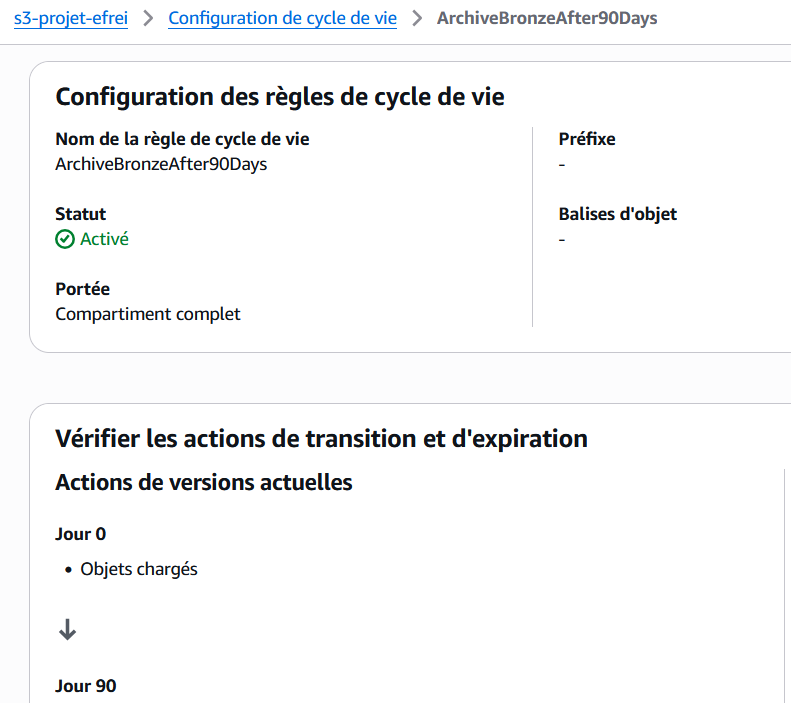


**Stratégie d'ingestion :**

| Stratégie | Approche retenue | Justification |
|---|---|---|
| Full load Bronze | Oui | Sources fournissent des snapshots journaliers complets |
| Incrémental Silver | Oui (`dbt incremental`) | `unique_key` + stratégie `incremental` dbt |
| Delta Gold | Oui (watermark) | Table `GOLD_WATERMARK`  filtre `date > last_date` |

---

### 3.2 Silver  Transformation dbt

**Principe :** dbt transforme les tables Bronze en tables Silver propres, typées et dédupliquées.

**Structure des modèles dbt :**

```
dbt_project/models/
├── air_quality/
│   ├── staging/          stg_air_quality.sql, stg_coordonnees.sql
│   └── intermediate/     int_air_quality_idf.sql
├── mobilite/
│   ├── staging/          stg_trafic_velo.sql, stg_trafic_routier.sql, stg_stations_velib.sql
│   └── intermediate/     int_velo_daily.sql, int_trafic_daily.sql
└── zones/
    ├── staging/          stg_arrondissements.sql
    └── intermediate/     int_air_quality_zoned.sql, int_velo_zoned.sql, int_trafic_zoned.sql
```

**Transformations appliquées :**

| Transformation | Couche | Description |
|---|---|---|
| Typage | staging | Cast VARCHAR/VARIANT vers types natifs (DATE, FLOAT, INT) |
| Déduplication | intermediate | `QUALIFY ROW_NUMBER() OVER (PARTITION BY pk ORDER BY ...) = 1` |
| Filtrage géographique | `int_air_quality_idf` | Filtre IDF uniquement (lat/lon) |
| Jointure spatiale | `int_*_zoned` | `ST_CONTAINS(geometry, ST_MAKEPOINT(lon, lat))` |
| Agrégation journalière | `int_air_quality_zoned` | `AVG(valeur)`, `MAX(valeur)` GROUP BY date + site + polluant |
| Renommage | tous staging | Colonnes en snake_case, noms métier explicites |

**Tests de qualité dbt automatisés (`schema.yml` + `tests/`) :**

```yaml
# schema.yml
tests:
  - not_null        # Clés primaires et colonnes critiques
  - unique          # Unicité des clés primaires
  - accepted_values # Polluants : [NO2, PM10, PM2.5, O3, SO2]

# tests/assert_no_future_dates.sql
#   -> date_mesure <= current_date()

# tests/assert_trafic_heures_within_day.sql
#   -> nb_heures_bloque + fluide + dense + saturé <= 24
```

---

### 3.3 Gold  Snowpark Python

**Principe :** Une Stored Procedure Snowpark (spark sur snowflake) Python calcule les 7 datamarts Gold depuis les tables Silver tout en utilisant la puissance de snowflake avec un calcul distribué dans le warehouse, gère le delta via watermark, et exporte en Parquet vers S3.

**Stored Procedure `SP_EXPORT_GOLD_TO_S3` :**
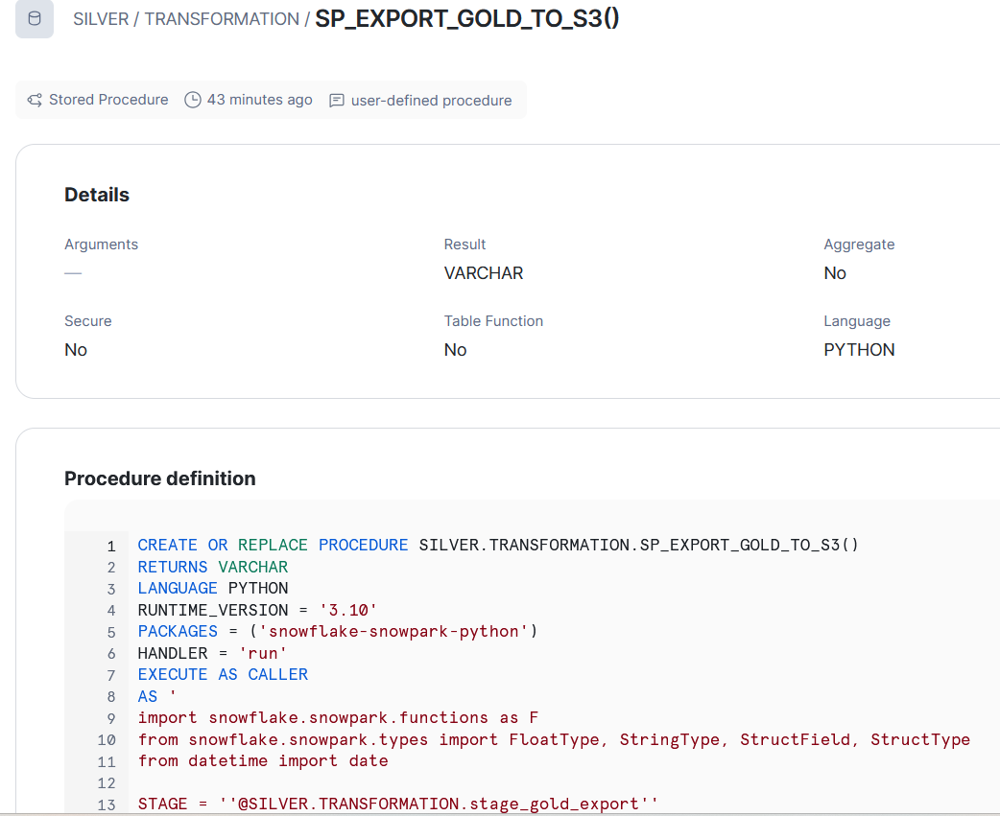

**Table de watermark `GOLD_WATERMARK` :**

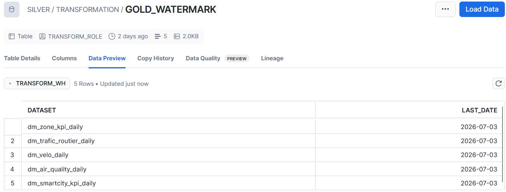

| Run | Comportement |
|---|---|
| Premier run (watermark = 1970-01-01) | Export complet de tout l'historique disponible |
| Runs suivants | Export uniquement des dates `> last_date` |
| Re-run le même jour | Pas de doublon (`overwrite=True` sur le fichier S3) |
| Échec Lambda RDS | Watermark non avancé -> données réexportées au run suivant |

**Les 7 datamarts Gold exportés :**

```
s3://s3-projet-efrei/gold_export/
├── dm_air_quality_daily/       20260701.parquet
├── dm_alertes_pollution/       20260701.parquet
├── dm_velo_daily/              20260701.parquet
├── dm_trafic_routier_daily/    20260701.parquet
├── dm_smartcity_kpi_daily/     20260701.parquet
├── dm_zone_kpi_daily/          20260701.parquet
└── ref_arrondissements/        20260701.parquet
```

---

### 3.4 Vélib temps réel  Kafka + DynamoDB

**Principe :** Le flux Vélib temps réel est simulé dans le cadre de notre projet data engineering cloud via un producer en utilisant l'api velib. Il utilise un pipeline séparé basé sur Kafka, indépendant du pipeline batch quotidien. Dans un context réel se sont des capteurs IOT qui envoient des données en temps réel mais nous ne pouvons pas reproduire cela.

```
API Vélib temps réel 
    -> EC2 Kafka Producer (producer_velib.py)
    -> Apache Kafka (EC2 t3.micro, eu-west-1)
    -> EC2 Kafka Consumer (consumer_velib.py)
    -> DynamoDB (table stations_velib)
    -> API Gateway -> Lambda FastAPI -> Streamlit
```

---

### 3.5 Serving Layer  Lambda RDS Import

**Pourquoi RDS PostgreSQL et pas Snowflake directement ?**

Le pipeline analytique utilise Snowflake comme moteur **OLAP** (Online Analytical Processing) : il est optimisé pour des requêtes complexes sur de grands volumes (scans complets, agrégations, jointures multi-tables), avec une latence de l'ordre de la **seconde**. Ce moteur convient parfaitement aux traitements dbt et Snowpark qui s'exécutent une fois par jour.

L'API REST exposée au dashboard Streamlit a des contraintes radicalement différentes : chaque appel utilisateur doit retourner une réponse en **< 50 ms**. C'est le domaine de l'**OLTP** (Online Transactional Processing), optimisé pour des lectures indexées sur des volumes maîtrisés.


Les 7 datamarts Gold sont calculés une fois par jour dans Snowflake (Snowpark), exportés en Parquet vers S3, puis chargés dans RDS via UPSERT. L'API interroge uniquement RDS Snowflake n'est jamais sollicité en temps réel.

**Principe :** Chaque Parquet déposé dans S3 Gold déclenche automatiquement une Lambda via EventBridge "Put Event" qui charge les données dans RDS via UPSERT idempotent.

**Flux :**
```
S3 PUT gold_export/dm_air_quality_daily/20260701.parquet
    -> EventBridge Rule (object created)
    -> Lambda RDS Import
        -> RDS PostgreSQL dm_air_quality_daily
```
---

### 3.6 Exposition  API Gateway + Streamlit


**Flux d'authentification Cognito (diagramme de séquence) :**


**FastAPI** (`infra_aws/api/code/main.py`) déployée sur Lambda + Mangum (adapter ASGI) :

| Endpoint | Source |
|---|---|
| `GET /air-quality` | RDS `dm_air_quality_daily` | 
| `GET /air-quality/alertes` | RDS `dm_alertes_pollution` |
| `GET /mobilite/trafic/daily-avg` | RDS `dm_trafic_routier_daily` | 
| `GET /mobilite/velo` | RDS `dm_velo_daily` |
| `GET /mobilite/velib` | DynamoDB | 
| `GET /kpi/summary` | RDS `dm_smartcity_kpi_daily` | 
| `GET /zones/kpi` | RDS `dm_zone_kpi_daily` | 
| `GET /zones/arrondissements` | RDS `ref_arrondissements` |
---

## 4. Guide de déploiement

### 4.1 Ordre de déploiement

```
1. Infrastructure Snowflake (Terraform : warehouses, rôles, stages)
2. DDL Snowflake (schémas, tables, Snowpipe, Tasks, SP Snowpark)
3. Infrastructure AWS (CloudFormation : S3, RDS, Lambda, EC2, DynamoDB, Cognito, API Gateway, SNS, KMS)
4. dbt (modèles Silver : staging + intermediate + zones)
5. DDL Gold PostgreSQL (V1__create_gold_tables.sql sur RDS)
6. Lambda API FastAPI (packaging + deploy)
7. Streamlit Cloud (connexion GitHub + secrets)
```

### 4.2 Infrastructure Snowflake (Terraform)


```bash
# Déploiement Terraform
cd infra_snowflake
terraform init
terraform plan -var-file="variables.tf"
terraform apply -auto-approve

# Terraform crée : TRANSFORM_WH, SILVER database, roles (TRANSFORM_ROLE,
# DATA_ANALYST_ROLE, INGESTION_ROLE), stage S3 (Storage Integration)
```

### 4.3 DDL Snowflake 

```bash
# Ou via le script Python fourni
python run_ddl.py
```

### 4.4 Infrastructure AWS (CloudFormation)


```bash
# 1. Rôles IAM 
aws cloudformation deploy \
  --template-file infra_aws/role/cloudformation/template/role-projet-efrei.json \
  --stack-name projet-efrei-iam --capabilities CAPABILITY_IAM

# 2. S3 
aws cloudformation deploy \
  --template-file infra_aws/s3/cloudformation/template/s3-projet-efrei.json \
  --stack-name projet-efrei-s3
```

### 4.5 dbt (Silver)

```bash
cd dbt_project
pip install snowflake-cli
snow dbt deploy
```

### 4.6 DDL Gold PostgreSQL

```bash
# via le script Python fourni
python run_gold_ddl.py
```

### 4.7 Streamlit Cloud

1. Connecter le repository GitHub à [share.streamlit.io](https://share.streamlit.io)
2. Sélectionner `Data_Enginnering_cloud/streamlit_app/app.py`
3. Configurer les secrets dans l'interface Streamlit Cloud
4. Deployer

## 5. Orchestration

### 5.1 DAG des tâches aws et Snowflake

L'orchestration batch est assurée par **Step Function et Snowflake Tasks** chaînées. Aucun outil externe (Airflow, Prefect) n'est requis.

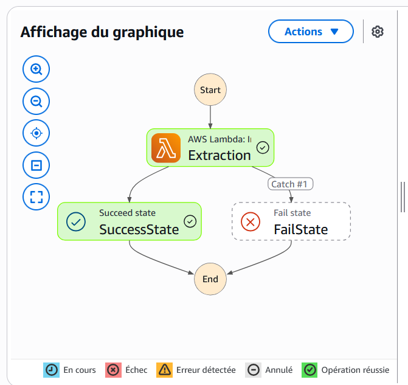

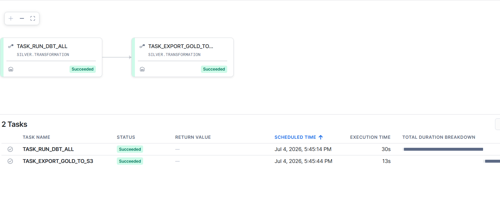


### 5.2 Gestion des erreurs & retry

| Composant | Comportement en cas d'erreur |
|---|---|
| Snowflake Task | Retry automatique configurable mais pas fait |
| `SP_EXPORT_GOLD_TO_S3` | Watermark non mis à jour si échec donc données réexportées au run suivant |
| Lambda RDS Import | Retry dès dépot des fichiers |

### 5.3 Scheduling complet

| Heure UTC | Action | Durée estimée |
|---|---|---|
| 07h00 | Lambda Extraction -> S3 Bronze | ~1 min |
| Automatique via SQS | Snowpipe -> Snowflake Bronze | ~1 min |
| 08h00 | TASK_RUN_DBT_ALL | ~1 min |
| Automatique avec dépendence Task 1 | TASK_EXPORT_GOLD_TO_S3 | ~1 min |
| Automatique via EventBridge | ~2 min |

---

## 6. Monitoring & Alerting

### 6.1 Architecture SNS Alerting

Toutes les alertes convergent vers **un seul topic SNS** `novasight-alerts` qui envoie un email à l'équipe. Trois sources distinctes y publient :

```
Step Functions
Lambda RDS Import 
Snowflake Task FAILED 
```

| Ressource | Type | Actions |
|---|---|---|
| `SNS Subscription` | Email | Envoi immédiat |

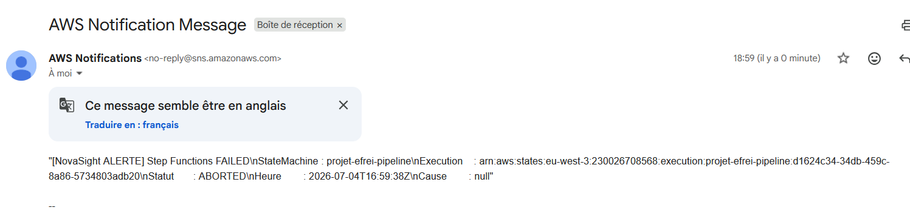


### 6.2 Monitoring Snowflake (SQL)

Des requêtes pour suivre les logs et à consulter dans Snowsight (Interface Snowflake) :

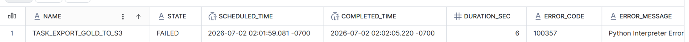

### 6.3 Snowflake Notification Integration

Les tasks Snowflake (`TASK_RUN_DBT_ALL` -> `TASK_EXPORT_GOLD_TO_S3`) publient sur le même topic SNS en cas d'échec via une **Notification Integration** 


### 6.4 SLA et alerting

| Canal | Déclencheur | 
|---|---|
| Email via SNS (EventBridge) | Step Functions FAILED / TIMED_OUT / ABORTED | 
| Email via SNS (CloudWatch) | Lambda RDS Import erreur  | 
| Email via SNS (SF Notification) | Task Snowflake FAILED | 

**SLA cibles :**
- Pipeline complet opérationnel
- Disponibilité dashboard Streamlit Cloud : 99,9 %
- Fraîcheur données : mise à jour avant 09h00 UTC

---

## 7. CI/CD  GitHub Actions

### 7.1 Vue d'ensemble des 6 workflows

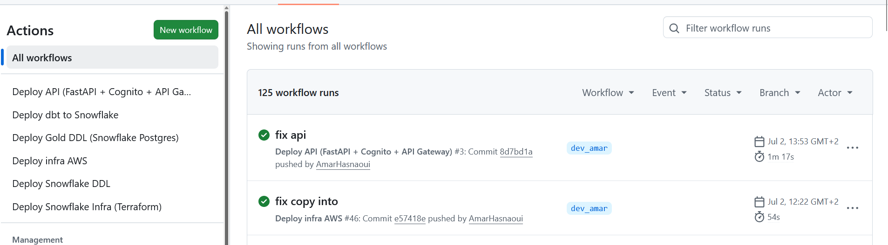

### 7.6 Politique de branches

| Branche | Usage | Protection |
|---|---|---|
| `main` | Production | PR requise, tests dbt obligatoires, review peer |
| `dev_amar` | Développement Amar | Tests requis |
| `dev_amine` | Développement Amine | Tests requis |
| `feature/*` | Nouvelles fonctionnalités | Merge via PR uniquement |

---

## 8. Analyse FinOps

> **Périmètre tarifaire :**
> - **AWS** : région `eu-west-3` (Paris)  tarifs on-demand officiels AWS Paris.
> - **Snowflake** : édition **Business Critical** sur AWS EU. 
> - **Hypothèses snowflake** : 1 pipeline batch/jour, 30 jours/mois, Warehouse XS actif ~5 min/jour donc 150min/mois 

### 8.1 Phase développement & recette

#### Snowflake  $35 consommés / $400 crédits trial

| Service | Usage dev | Coût dev |
|---|---|---|
| Snowflake Trial (Business Critical, WH XS) | 30 jours | **$35** sur $400 crédits offerts |

#### AWS  $7 consommés / $200 crédits trial
| Service | Usage dev | Coût dev |
|---|---|---|
| AWS Trial  | 6 mois | **$7** sur $200 crédits offerts |

### 8.2 Exploitation quotidienne  Business Critical · AWS Paris (eu-west-3)

| Service | Usage mensuel | Calcul détaillé | Coût/mois |
|---|---|---|---|
| **Snowflake  Compute WH XS** | 2,5 crédits | 5 min/j × 30 j = 2,5 crédits × $5,20/crédit | **$13,00** |
| **Snowflake  Snowpipe serverless** | 0,00411 crédit serverless | 0,00411 × $5,20 | **$0,02** |
| **Snowflake  Stockage** | 100 MO compressés | 0,0001 TB × 24 $/TB/mois | **$0,0024** |
| **Amazon RDS db.t3.micro** || | **$36,24** |
| **EC2 t3.micro** (Kafka) | || **$16,992** |
| **Amazon S3** | ~2 GB | $0,024/GB × 2 GB Standard  | **$0,048** |
| **AWS Lambda** (3 fonctions) | 15000 invocations/mois | < 1 M req + < 400 000 GB-s -> **free tier permanent** | **$0,0130386** |
| **Amazon API Gateway** (REST) | 15000 requêtes | Premier palier 300M : $1,17/M   | **$1,17** |
| **Amazon DynamoDB** (on-demand) | |  | **$48,66** |
| **AWS Step Functions** | ~60 transitions | 4 000 transitions gratuites permanent  | **$0** |
| **AWS KMS** (3 clés CMK) |  |   | **$0** |
| **AWS Secrets Manager** | 1 secret | 1 × $0,40  | **$0,40** |
| **EventBridge** (S3 events Gold) |  |   | **$0** |
| **Amazon Cognito** | < 50 000 MAU | Free tier permanent  | **$0** |
| **Amazon SNS** | < 100 000 MAU | 100000 email = **$2**  | **$0** |
| | | | |
| **TOTAL MENSUEL** | | | **~$117** |
| **TOTAL ANNUEL** | | | **~$1404** |


### 8.3 Documentation officielle des tarifs

| Service | Lien documentation |
|---|---|
| Snowflake  Tarifs Business Critical | [snowflake.com/pricing](https://www.snowflake.com/pricing/) |
| Snowflake  Trial credits | [docs.snowflake.com/user-guide/admin-trial-account](https://docs.snowflake.com/en/user-guide/admin-trial-account) |
| Snowflake  Coût stockage & compute | [docs.snowflake.com/cost-understanding-overall](https://docs.snowflake.com/en/user-guide/cost-understanding-overall) |
| Snowflake  Facturation Snowpipe | [docs.snowflake.com/data-load-snowpipe-billing](https://docs.snowflake.com/en/user-guide/data-load-snowpipe-billing) |
| AWS  Free Tier (tous services) | [aws.amazon.com/free](https://aws.amazon.com/free/) |
| Amazon S3  Tarifs eu-west-3 | [aws.amazon.com/s3/pricing](https://aws.amazon.com/s3/pricing/) |
| AWS Lambda  Tarifs | [aws.amazon.com/lambda/pricing](https://aws.amazon.com/lambda/pricing/) |
| Amazon RDS PostgreSQL  Tarifs eu-west-3 | [aws.amazon.com/rds/postgresql/pricing](https://aws.amazon.com/rds/postgresql/pricing/) |
| Amazon DynamoDB  Tarifs eu-west-3 | [aws.amazon.com/dynamodb/pricing](https://aws.amazon.com/dynamodb/pricing/) |
| Amazon API Gateway  Tarifs eu-west-3 | [aws.amazon.com/api-gateway/pricing](https://aws.amazon.com/api-gateway/pricing/) |
| Amazon EC2  Tarifs on-demand eu-west-3 | [aws.amazon.com/ec2/pricing/on-demand](https://aws.amazon.com/ec2/pricing/on-demand/) |
| AWS Step Functions  Tarifs | [aws.amazon.com/step-functions/pricing](https://aws.amazon.com/step-functions/pricing/) |
| Amazon CloudWatch  Tarifs | [aws.amazon.com/cloudwatch/pricing](https://aws.amazon.com/cloudwatch/pricing/) |
| AWS KMS  Tarifs | [aws.amazon.com/kms/pricing](https://aws.amazon.com/kms/pricing/) |
| AWS Secrets Manager  Tarifs | [aws.amazon.com/secrets-manager/pricing](https://aws.amazon.com/secrets-manager/pricing/) |
| Amazon EventBridge  Tarifs | [aws.amazon.com/eventbridge/pricing](https://aws.amazon.com/eventbridge/pricing/) |
| Amazon Cognito  Tarifs | [aws.amazon.com/cognito/pricing](https://aws.amazon.com/cognito/pricing/) |


### 8.4 Optimisations FinOps

| Optimisation | Économie estimée | Détail |
|---|---|---|
| `AUTO_SUSPEND = 60s` Snowflake WH | −40 % compute | `ALTER WAREHOUSE TRANSFORM_WH SET AUTO_SUSPEND = 60` |
| Parquet snappy vs CSV | −75 % stockage S3 | Natif dans `COPY INTO` Snowflake (`FILE_FORMAT = PARQUET`) |
| S3 Lifecycle Rules Bronze | −60 % stockage Bronze | Glacier Instant après 90 j |
| RDS Reserved Instance 1 an | −20 % vs on-demand | ~$28,99/mois vs $36,24/mois (Paris eu-west-3) |
| EC2 Reserved Instance 1 an (Kafka) | −19 % vs on-demand | ~$13,76/mois vs $16,992/mois (Paris eu-west-3) |
| S3 Bucket Key KMS | −99 % appels KMS API | `BucketKeyEnabled: true` 1 clé de données par bucket au lieu de 1 par objet |

### 8.5 Comparatifs de services

Un tableau comparatif avant chaque choix de service. Les critères évalués sont : coût, performance, intégration avec la stack, complexité opérationnelle, disponibilité d'un free tier, risque de vendor lock-in.

---

#### Data Warehouse Cloud : Snowflake vs Redshift vs BigQuery

| Critère | **Snowflake**  | Amazon Redshift | Google BigQuery |
|---|---|---|---|
| **Coût compute** | $5,20/crédit (Business Critical) · XS = 1 crédit/h → $5,20/h · AUTO_SUSPEND évite la facturation à vide | ra3.large : $0,633/h/nœud, 2nœuds=$1,27/h **même sans requête** | On-demand : ~$7,8125/TB scanné · 1 TB/mois gratuit · facturation à la requête |
| **Coût stockage** | $24/TB/mois | $0,025/GB/mois ($25/TB) | $0,05/GB/mois ($50/TB) actif |
| **Performance** | MPP, micro-partitions, pruning automatique, Result Cache 24h | MPP solide, mais performances dépendent du tri des colonnes | Serverless, colonnar, performant mais latence variable selon slot disponibles |
| **Intégration stack** | Native dbt-snowflake, Snowpipe SQS, Snowpark Python, Tasks intégration directe avec notre S3 AWS | AWS-native : Redshift Spectrum sur S3, Glue, Lambda | BigQuery Transfer Service intégration S3 |
| **Complexité opérationnelle** | Zéro administration infrastructure Virtual Warehouse auto-géré | Administration cluster (resize, maintenance, vacuum/analyze réguliers) | Zéro infrastructure serverless natif |
| **Free tier / crédits** | $400 de crédits trial (utilisés en dev) | Pas de free tier | 1 TB/mois de requêtes gratuit · 10 GB stockage/mois |
| **Vendor lock-in** | SQL standard + Snowpark Python · données exportables Parquet tourne sur AWS/GCP/Azure | SQL Redshift données exportables S3 AWS-only | SQL standard + BigQuery ML  données exportables GCP-only |
| **Décision retenue** | **Retenu**  séparation stockage/compute (pas de facturation à vide), intégration native avec notre stack AWS (Snowpipe SQS, IAM Storage Integration), multi-cloud portable | Non retenu  cluster toujours facturé même inactif| Non retenu  GCP-native stockage couteux |

> Sources : 
>- [snowflake.com/pricing](https://www.snowflake.com/pricing/) 
>- [aws.amazon.com/redshift/pricing](https://aws.amazon.com/redshift/pricing/) 
>- [cloud.google.com/bigquery/pricing](https://cloud.google.com/bigquery/pricing)

---

#### Orchestration : Step Functions vs Airflow self-hosted vs MWAA

| Critère | **AWS Step Functions** | Apache Airflow self-hosted | Amazon MWAA |
|---|---|---|---|
| **Coût** | $0,000025 / transition d'état avec 4 000 transitions/mois **gratuites à vie** -> **dans le free tier** | EC2 t3.medium ~$0,0472/h -> ~$34/mois | Small env : $0,58/h → **~$417/mois** (Si toujours actif) |
| **Performance** | Exécution parallèle native, retry par step, timeout configurable | DAG Celery/Redis | Identique Airflow |
| **Intégration stack** | Native AWS : Lambda, ECS, Glue, SNS, CloudWatch · déclenchable par EventBridge | Plugin AWS disponible mais configuration manuelle des credentials | Native AWS : IAM roles, S3, CloudWatch natif |
| **Complexité opérationnelle** | Zéro serveur à gérer · définition JSON/YAML, visual debugger console AWS | Installation, upgrade Airflow, Celery workers, Redis | Zéro serveur mais configuration MWAA complexe (VPC...) |
| **Free tier / crédits** | **4 000 transitions/mois gratuites à vie** (non limité à 12 mois) | Pas de free tier (coût EC2) | Pas de free tier |
| **Vendor lock-in** | AWS-only ASL (Amazon States Language) propriétaire mais simple | Open source portable tout cloud | AWS-only DAGs Airflow standard (portable) |
| **Décision retenue** | **Retenu** entièrement dans le free tier pour notre volume, zéro infrastructure, retry natif par step, alertes SNS natives via EventBridge | Non retenu, coût EC2 dédié + charge opérationnelle (upgrades, workers) injustifiée | Non retenu, MWAA pertinent à partir de centaines de DAGs complexes |

> Sources : 
> - [aws.amazon.com/step-functions/pricing](https://aws.amazon.com/step-functions/pricing/) 
>- [aws.amazon.com/managed-workflows-for-apache-airflow/pricing](https://aws.amazon.com/managed-workflows-for-apache-airflow/pricing/)

---

#### Dashboard Gold : Streamlit vs Metabase vs Apache Superset

| Critère | **Streamlit** | Metabase | Apache Superset |
|---|---|---|---|
| **Coût** | Open source, self-hosted ou snowflake cloud | Open source self-hosted (gratuit) ou Metabase Cloud $575/mois | Open source, self-hosted (gratuit) |
| **Performance** | Rendu côté serveur Python, temps de réponse dépend du backend | Cache interne, requêtes SQL directes sur la BDD | Cache,Redis, requêtes SQL + API |
| **Intégration stack** | **Python natif** | Connecteur PostgreSQL natif, pas de connexion DynamoDB native | Connecteur PostgreSQL natif, pas de connexion DynamoDB native |
| **Complexité opérationnelle** | Déploiement `streamlit run app.py`, code Python = même langage que le reste du projet | Interface drag-and-drop, aucune compétence Python requise | Setup complexe (Redis, Celery, PostgreSQL) avec courbe d'apprentissage élevée |
| **Free tier / crédits** | Gratuit, Streamlit Community Cloud disponible pour hébergement public | Gratuit self-hosted | Gratuit self-hosted |
| **Vendor lock-in** | Code Python standard, aucune dépendance propriétaire | Métadonnées propriétaires Metabase (collections, questions) | Open source Apache, communauté active |
| **Décision retenue** | **Retenu** seul outil permettant d'intégrer en Python les trois sources Gold (RDS PostgreSQL, DynamoDB temps réel, API FastAPI) dans un seul dashboard interactif, sans coût additionnel | Non retenu, interface drag-and-drop inadaptée aux visualisations géospatiales et à l'intégration DynamoDB | Non retenu, complexité mise en place|

> Sources : 
>- [streamlit.io](https://streamlit.io)
>- [metabase.com/pricing](https://www.metabase.com/pricing) 
>- [superset.apache.org](https://superset.apache.org)

---

## 9. Sécurité  Chiffrement KMS & RGPD

### 9.1 Chiffrement avec clé KMS privée (CMK)

**Implémenté :**
- **S3**  SSE-KMS avec CMK `alias/projet-efrei-s3`, `BucketKeyEnabled: true`.
- **RDS PostgreSQL**  `StorageEncrypted: true` + CMK `alias/projet-efrei-rds` (instance `rds-projet-efrei`).

**Clé AWS managée :**
- Lambda et Secrets Manager utilisent le chiffrement par défaut AWS (pas de CMK, sans surcoût).

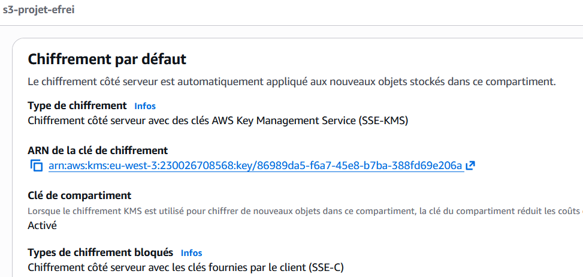

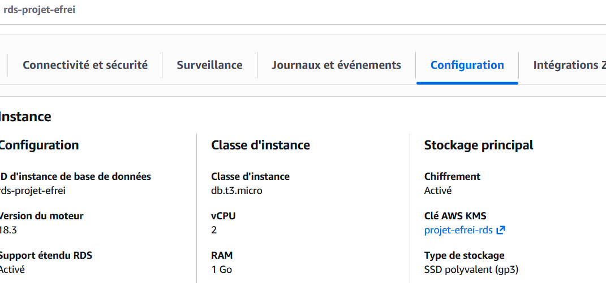

### 9.2 Accès S3
L'accès public au compartiment et objets est désactivé aux public

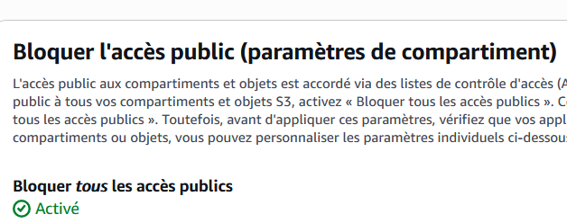

### 9.3 Rôles et privileges 

#### AWS IAM

Chaque rôle est **scopé au strict nécessaire** : aucun wildcard `*` sur les ressources, chaque action est restreinte au service et au préfixe qu'il manipule réellement.

#### Snowflake

Les rôles Snowflake suivent le même principe : chaque rôle n'accède qu'aux schémas et objets nécessaires à sa fonction.

| Rôle Snowflake | Utilisé par | Périmètre |
|---|---|---|
| `TRANSFORM_ROLE` | dbt, Snowpark SP, Tasks | Lecture/écriture sur les schémas Silver et Bronze, exécution des Tasks et Stored Procedures, accès au Warehouse `TRANSFORM_WH` |
| `GITHUB_ROLE` | GitHub Actions CI/CD uniquement | Déploiement infra et DDL (CREATE/ALTER objets et INTEGRATION), pas d'accès aux données métier |
| `ANALYST_ROLE` | Data analysts, Snowsight | SELECT uniquement sur Silver, aucun accès Bronze brut, aucune écriture |

> **Principe appliqué :** aucun rôle applicatif ou data n'a de droits `ACCOUNTADMIN` ou `SYSADMIN`. Les opérations d'administration (création d'intégrations, gestion des objets) sont isolées dans `GITHUB_ROLE` pour le CI/CD

---


### 9.4 Cartographie des données  Data Mapping RGPD

| Source | Champs | Catégorie RGPD | Niveau de risque | Action |
|---|---|---|---|---|
| Qualité de l'air (AIRPARIF) | code_site, valeur, polluant | Données publiques | **Nul** | Aucune |
| Trafic vélo | compteur_id, total_passages | Données agrégées | **Nul** | Aucune |
| Trafic routier | arc_id, libelle_arc, débit | Données de voirie | **Nul** | Aucune |
| Vélib temps réel | stationId, num_bikes_available | Données publiques | **Nul** | Aucune |
| Coordonnées GPS stations | latitude, longitude | Localisation infrastructures publiques | **Faible** | Maintenues en clair (public) |
| Utilisateurs dashboard | email (Cognito) | Donnée personnelle | **Moyen** | Géré par Cognito uniquement, hors pipeline data |

> Les données traitées par le pipeline Bronze -> Gold sont **entièrement publiques et anonymes**. Le seul traitement de données personnelles concerne les comptes utilisateurs du dashboard, gérés exclusivement par **Amazon Cognito**.

### 9.5 Registre de traitement simplifié

| Traitement | Finalité | Base légale | Données | Rétention |
|---|---|---|---|---|
| Ingestion mesures air | Analyse environnementale académique | Intérêt légitime | Mesures publiques AIRPARIF | 90 j Bronze, illimité Silver |
| Comptage vélo/trafic | Analyse mobilité urbaine | Intérêt légitime | Comptages anonymes | 90 j Bronze, illimité Silver |
| Vélib temps réel | Information mobilité | Intérêt légitime | Disponibilité stations publiques | dernier état seulement |
| Authentification dashboard | Contrôle d'accès | Consentement | Email + mot de passe hashé (Cognito) + token | Durée du projet |

### 9.6 Politique de rétention des données

| Couche | Support | Rétention | Mécanisme |
|---|---|---|---|
| Bronze | S3 | 90 jours | S3 Lifecycle : Glacier après 90 j |
| Silver | Snowflake | Illimité | Conservation analytique |
| Gold | S3 | 90 jours (delta) |  Lifecycle après 90 j |
| Gold | RDS PostgreSQL | Illimité | UPSERT (pas de doublons) |
| Vélib | DynamoDB | temps réel | dernier état seulement |
---
